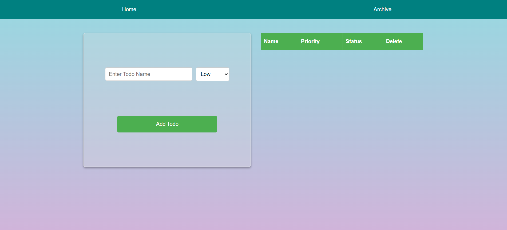
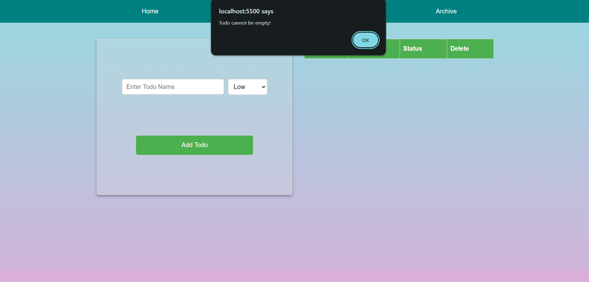
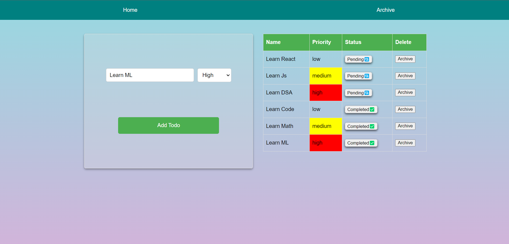
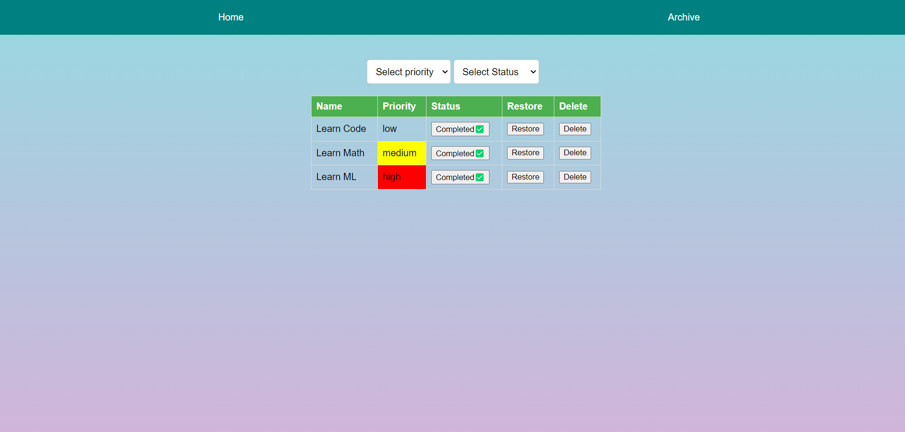
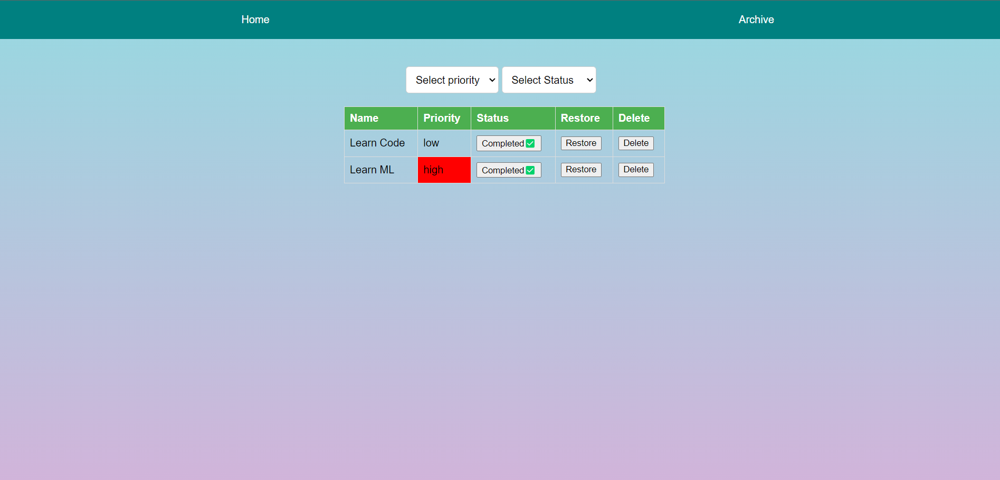
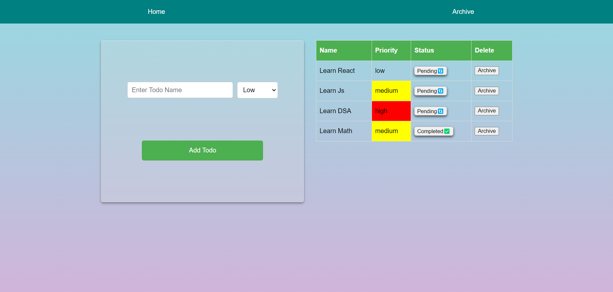
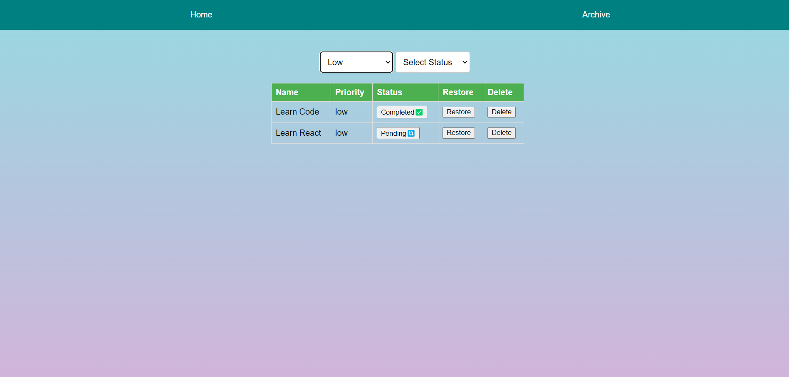
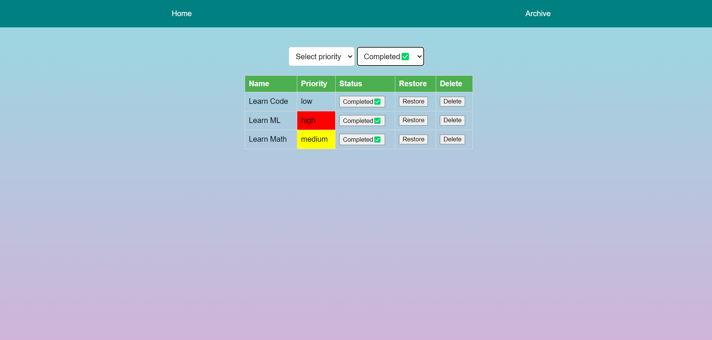
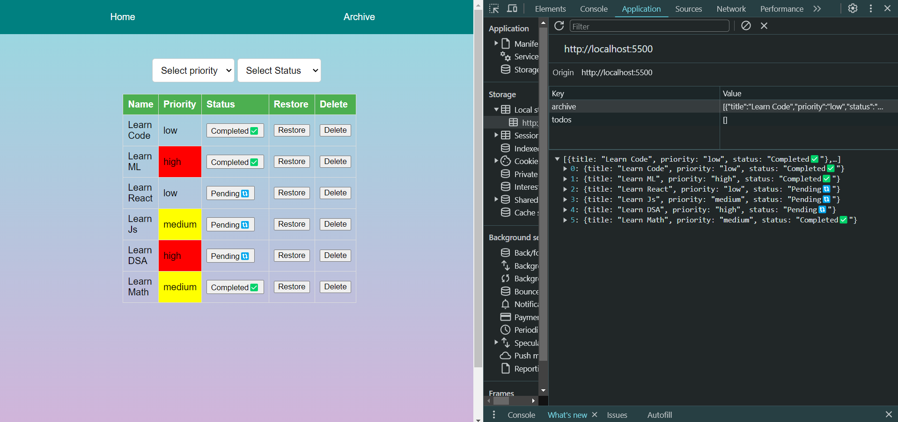

# Todo Web Application

This is a simple todo web application built using HTML, CSS, and JavaScript with local storage functionality.

## Features

- **Adding Todo Entries**: Users can add todo entries with priorities (low, medium, high). The color of the todo entry will be determined by its priority level.
- **Validation**: Users will receive an alert message if they try to add a todo without entering any text.
- **Displaying Todo Entries**: After adding a todo entry, a table row will be created displaying the title of the todo, its priority, status (defaulted to pending), and an archive button.
- **Toggle Status**: Users can toggle the status of a todo entry from pending to completed. Completed entries can then be moved to the archive.
- **Archive Page**: Archived todo entries are moved to a separate archive page. Users can view, restore, or delete entries from the archive.
- **Filters**: Two filters are available:
  - Priority Filter: Users can filter todo entries by priority (low, medium, high).
  - Status Filter: Users can filter todo entries by status (completed or pending).

## Usage

1. https://todo-web-app-rohitbhise.netlify.app/ - can use this website or ->
2. Clone or download the repository to your local machine.
3. Open `index.html` in your web browser to use the todo application.

## Creenshots & Video of Usage.
1.  This is the landing page of the Todo Web Application
   
   
2. If we submit blank entry will get an alert message for the same.
   
   
   
3. Below i have added few entries with all priorities and pending completed status (Which is a toggle).
   
   

4. I have clicked on Archive button for all completed status entries.

   

5. Here we have restore and i am restoring medium priority entry from this archive list.

   

6. And here below you can see that restored entry from archive page got displayed here .

   

7. Below I am displaying the filtered data (Here i have set the priority to -"Low" ) so it is only showing wntry with the Low priority.
   like wise same for medium and high priority as well.

   .

9.And below is the same filter functionality for Status. I have selected Completed status from option.

  

10. To show the Local storgae data i ahe moved all the entries from home to archive page.

    
    
11. And if we hit delete button it will clear the entry data from the local storage itself as i have deleted all the entries with Completed Status.
    And as you can see in local storage there's no entry with the Completed Status.
  
  

   
#Video of the test .

https://github.com/rohit024b/Todo_WebApp/assets/35328235/41710ab9-5f68-4bd8-8f36-8b57a7505f93

## Note

This is a personal project with no contributors involved. Feel free to customize and use the code according to your needs.

